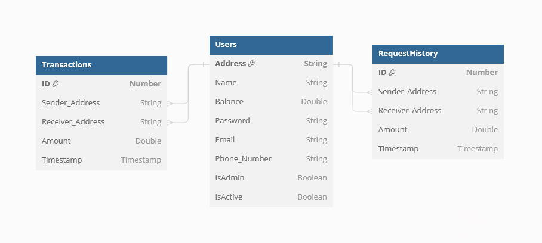
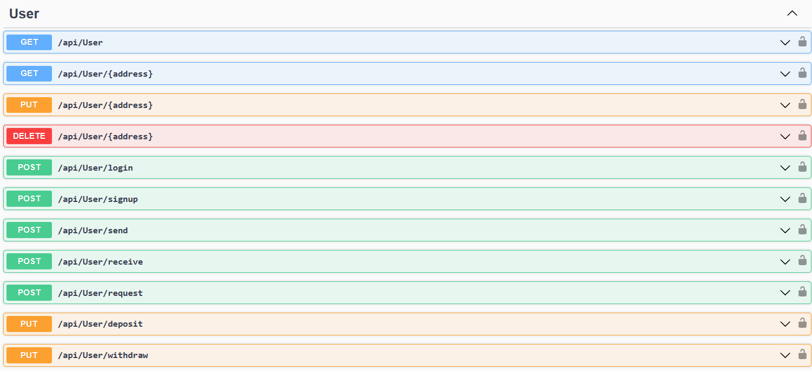
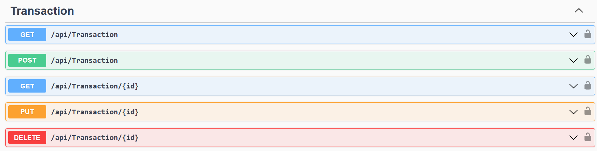

# Simple Digital Wallet API


## Table of Contents

- [Introduction](#introduction)
- [Features](#features)
- [Project's Schema](#projects-schema)
- [API Endpoints](#api-endpoints)
- [Installation](#installation)
- [Usage](#usage)
- [Contributing](#contributing)

## Introduction

Welcome to the Simple Digital Wallet API! This project rephrases and enhances the old C++ code to provide a comprehensive digital wallet solution for managing transactions, user accounts, authentication, and more. It is designed to offer a secure and efficient platform for handling financial activities digitally through a RESTful API.

## Features

- User authentication and management (including admins and regular users)
- Secure password handling with hashing
- Transaction management (sending money, requesting money, viewing transaction history)
- Notification system for handling money requests
- Deposit and withdrawal functionalities
- Profile management (editing user details)
- Error handling for various scenarios

## Project's Schema



In this schema, users are stored in the **Users** table with attributes like address, name, balance, etc. The **Transactions** table logs all transactions, including sender and receiver addresses, amounts, and types. Similarly, the **RequestHistory** table tracks money requests between users, with sender and receiver addresses, amounts, and timestamps. Both transactions and requests are associated with users via their addresses.

## API Endpoints


### User Endpoints
- `GET /api/user` - Retrieve all users (excluding passwords)
- `GET /api/user/{address}` - Retrieve a specific user by address
- `POST /api/user/signup` - Register a new user
- `POST /api/user/login` - Login a user
- `PUT /api/user/{address}` - Update user details
- `DELETE /api/user/{address}` - Delete a user



### Transaction Endpoints
- `GET /api/transaction` - Retrieve all transactions
- `GET /api/transaction/{id}` - Retrieve a specific transaction by ID
- `POST /api/transaction` - Add a new transaction
- `PUT /api/transaction/{id}` - Update a transaction
- `DELETE /api/transaction/{id}` - Delete a transaction



### Transaction Actions
- `POST /api/transaction/send` - Send money
- `POST /api/transaction/receive` - Receive money
- `POST /api/transaction/request` - Request money
- `POST /api/transaction/deposit` - Deposit money
- `POST /api/transaction/withdraw` - Withdraw money

## Installation

1. Clone the repository:
    ```bash
    git clone https://github.com/Abraam318/simple-digital-wallet.git
    ```
2. Navigate to the project directory:
    ```bash
    cd simple-digital-wallet
    ```
3. Restore dependencies and run the project:
    ```bash
    dotnet restore
    dotnet run
    ```

## Usage

To use the Simple Digital Wallet API, follow these steps:

1. Clone the repository.
2. Navigate to the project directory.
3. Run the project using `dotnet run`.
4. Use a tool like Postman or Curl to interact with the API endpoints for signing up, logging in, performing transactions, managing profiles, etc.

## Contributing

Contributions are welcome! Please fork the repository and submit a pull request.
